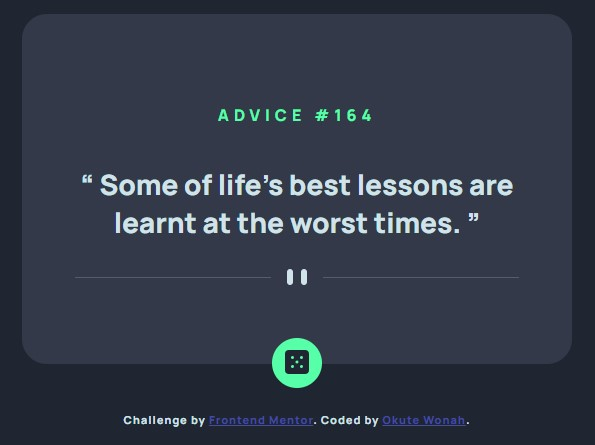

# Frontend Mentor - Advice generator app solution

This is a solution to the [Advice generator app challenge on Frontend Mentor](https://www.frontendmentor.io/challenges/advice-generator-app-QdUG-13db). Frontend Mentor challenges help you improve your coding skills by building realistic projects.

## Table of contents

- [Overview](#overview)
  - [The challenge](#the-challenge)
  - [Screenshot](#screenshot)
  - [Links](#links)
- [My process](#my-process)
  - [Built with](#built-with)
  - [What I learned](#what-i-learned)
  - [Continued development](#continued-development)
- [Author](#author)
- [Acknowledgments](#acknowledgments)

## Overview

### The challenge

Users should be able to:

- View the optimal layout for the app depending on their device's screen size
- See hover states for all interactive elements on the page
- Generate a new piece of advice by clicking the dice icon

### Screenshot



### Links

- Solution URL: [Solution page](https://github.com/okutewonah/fm-advice-generator)
- Live Site URL: [View live](https://okutewonah.github.io/fm-advice-generator/)

## My process

### Built with

- Semantic HTML5 markup
- CSS custom properties
- Flexbox
- JavaScript
- [Advice Slip API](https://api.adviceslip.com)

### What I learned

I learnt to use blockquote and q for the first time instead of using directed quotes for the advices. 
I also introduced the use of a spinner to display while a quote loads.

```html
<blockquote class="quote-text">
  <q>
    <span id="quote"></span>
  </q>
</blockquote>
```

## Author

- Frontend Mentor - [@okutewonah](https://www.frontendmentor.io/profile/okutewonah)
- Github - [okutewonah](https://github.com/okutewonah)